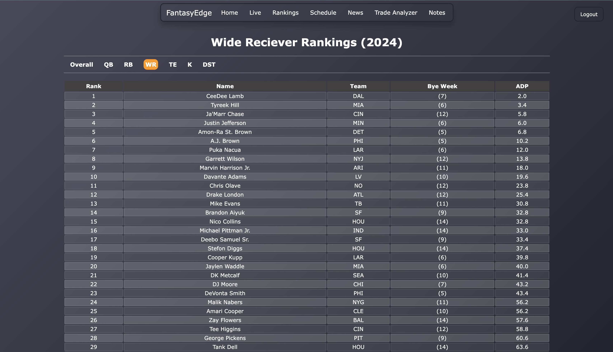
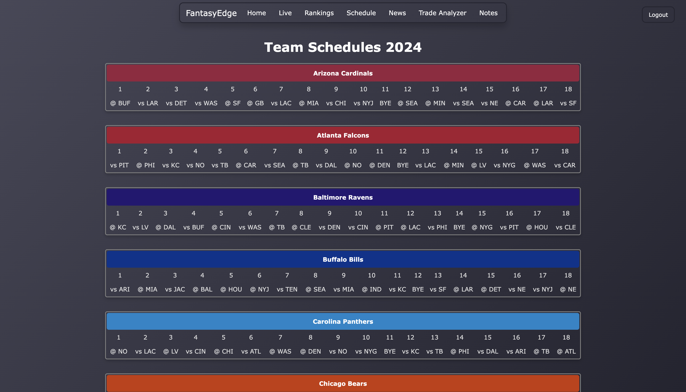
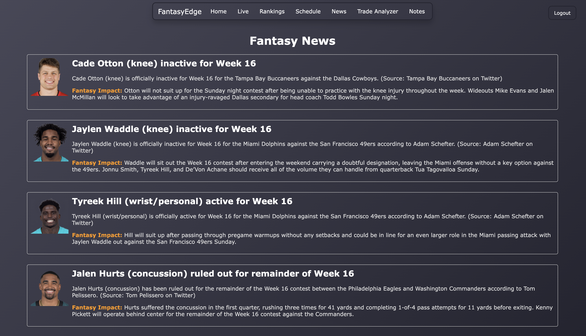
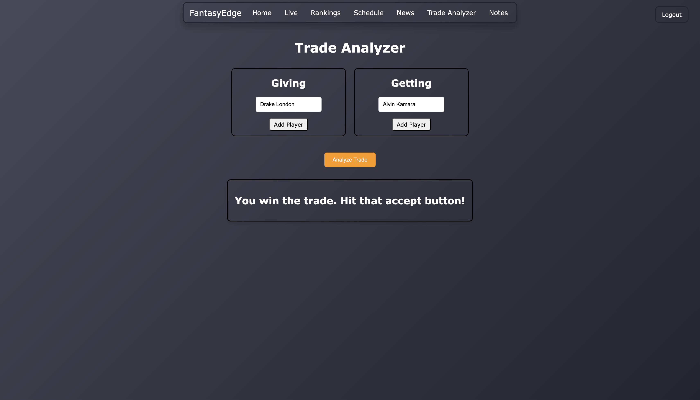
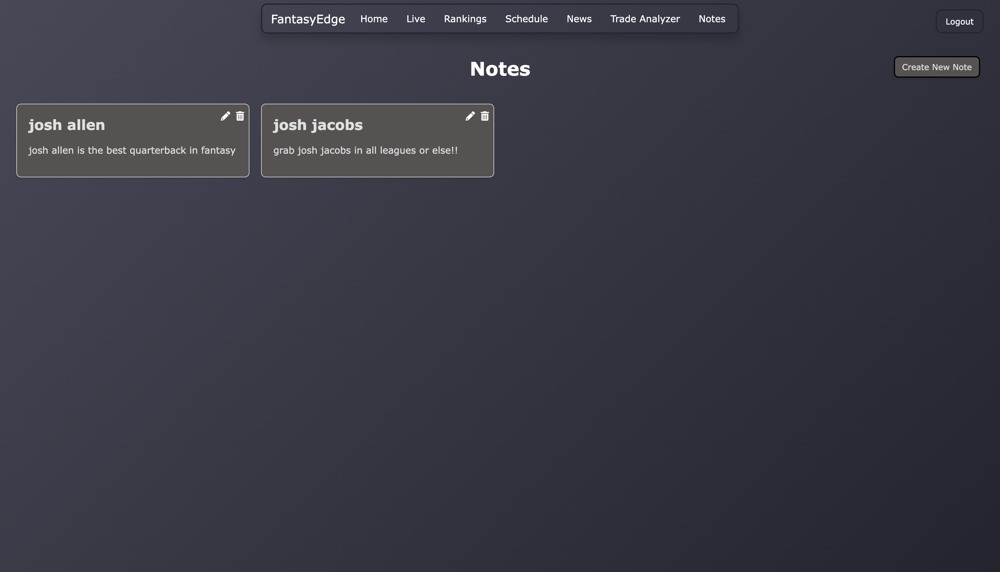

# FantasyEdge
Web Application made to assist uers with their fantasy football season. Get ahead of your leaguemates!

## How to Use
Access FantasyEdge [here!](https://fantasy-edge.vercel.app/)

## Features
### Rankings
- View player rankings for the upcoming season, ability to filter by position.  
- More filters coming soon!

### Schedules
- View all team schedules for the upcoming season. 

### News
- View all the breaking news on your most important studs. 

### Trade Analyzer
- Not sure if you should make a trade? Plug in the players into our trade analyzer!

### Notes
- Allows users to take detailed notes on players, teams, or strategies to help prepare for their season.
- Notes are saved to the user's account, ensuring they are accessible to only them.

## Future Enhancements
### Live Feature
- Difficult to keep track of all your players every Sunday? The live feature will allow you to see  
instant updates on each of your players in real-time.
